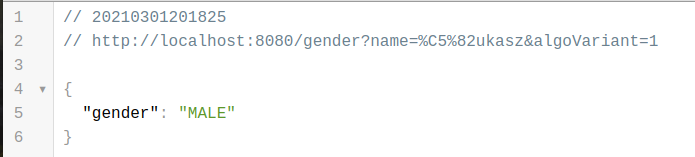
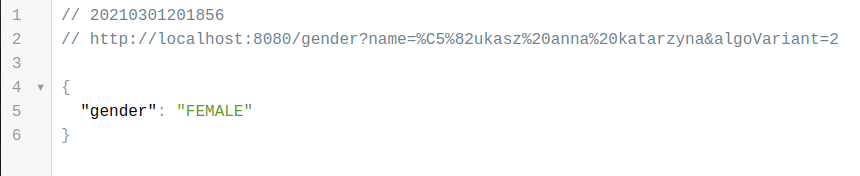
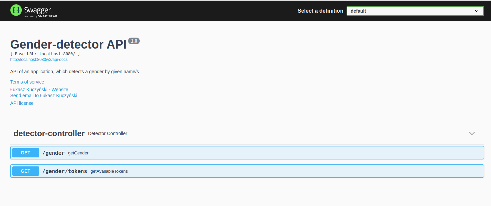

# Gender detector
An app for gender detection by given name/s.

## General info
This app detects gender of a person by given name or names.
Rest API has been documented by Swagger.

## Technologies
* Java - version 11
* Spring Boot - version 2.4.3

## Screenshots

## Features
Gender detecting algorithm has been implemented in two variants:
* Only first token of name is checked
* All tokens are checked and majority rule is used.

Application has two REST endpoints:
* /gender - returns 'MALE', 'FEMALE' or 'INCONCLUSIVE'\
(with two parameteres: 'name' as input String and 'algoVariant' as the variant of the algorithm (1 or 2))
* /gender/tokens - returns available female and male tokens

## Contact
Created by [@kuczynskil](https://www.github.com/kuczynskil) - feel free to contact me!
